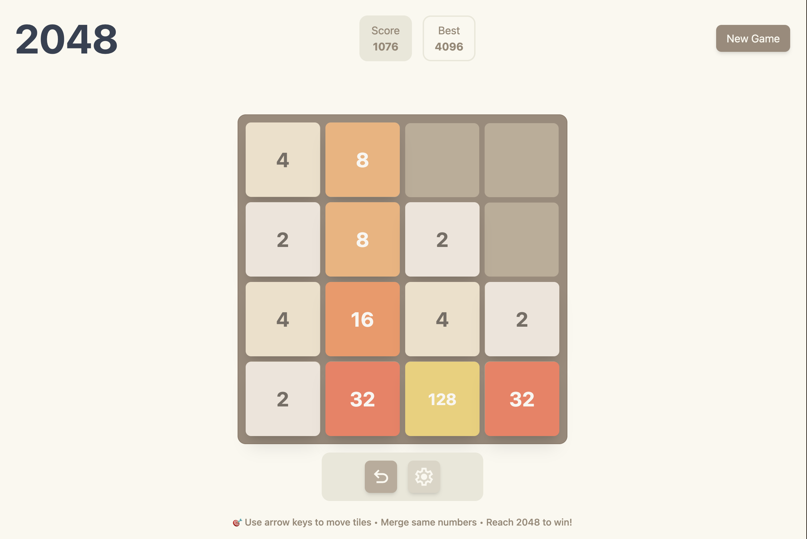

# 🎮 2048 Game

A modern implementation of the classic 2048 puzzle game built with React, TypeScript, and performance optimizations.

## 🌐 Live Demo

**[Try the game here](https://mykhailonl.github.io/2048/)**




## ✨ Features

### 🎯 Core Gameplay

- **Classic 2048 mechanics** with smooth tile movement and merging
- **Multiple input methods**: keyboard arrows and touch swipe gestures
- **Undo system** with limited charges (earn more by creating 128 tiles)
- **Persistent game state** with automatic save/load functionality
- **Win/lose detection** with modal notifications

### 🎨 User Experience

- **Smooth animations** powered by Framer Motion
- **Responsive design** that works on desktop, tablet, and mobile
- **Reduce motion toggle** with user preference persistence in localStorage
- **Visual feedback** with tile merge animations and state transitions

### ⚡ Performance Optimizations

- **React.memo** on GameCell and ScoreCard components to prevent unnecessary re-renders
- **Map-based tile lookup** for O(1) coordinate access instead of O(n) array searches
- **useMemo** for expensive tile coordinate mapping operations

### ♿ Accessibility

- **Keyboard navigation** with arrow keys and escape for modals
- **Basic ARIA labels** on interactive elements and buttons
- **Semantic HTML** structure with proper headings
- **Reduce motion support** for users with motion sensitivity

## 🛠️ Technology Stack

### Frontend

- **React 19** with functional components and hooks
- **TypeScript** for type safety and developer experience
- **Tailwind CSS** with custom design system and container queries
- **Framer Motion** for performant animations

### Development Tools

- **Vite** for fast development and optimized builds
- **Vitest** for unit testing with comprehensive coverage
- **ESLint + Prettier** for code quality and formatting
- **React DevTools** for performance profiling

### Architecture

- **Context API** for global state management
- **Custom hooks** for reusable game logic
- **Reducer pattern** for complex state updates
- **Separation of concerns** with utils, types, and components

## 🚀 Getting Started

### Prerequisites

- Node.js 18+ and npm

### Installation

```bash
# Clone the repository
git clone https://github.com/mykhailonl/2048.git
cd 2048

# Install dependencies
npm install

# Start development server
npm run dev

# Open http://localhost:5173 in your browser
```

### Available Scripts

```bash
  npm run dev          # Start development server
  npm run build        # Build for production
  npm run preview      # Preview production build
  npm run test         # Run unit tests
  npm run test:ui      # Run tests with UI
  npm run lint         # Lint code
  npm run lint:fix     # Fix linting issues
  npm run format       # Format code with Prettier
```

## 🎮 How to Play

1. **Movement**: Use arrow keys (↑↓←→) or swipe on touch devices
2. **Objective**: Combine tiles with the same number to reach 2048
3. **Merging**: When tiles with the same number touch, they merge into one
4. **Undo**: Use undo charges to reverse moves (earn more by creating 128 tiles)
5. **Win**: Reach the 2048 tile to win (but you can continue playing)

## 🧪 Testing

The project includes unit tests for key functionality:

- **Game logic utilities**: Tile positioning and coordinate calculations
- **State management**: Game reducer with all action types
- **Custom hooks**: localStorage integration with error handling


## 🏗️ Project Structure

```
src/
├── components/                     # React components
│   ├── GameBoard/                  # Main game board with tile rendering
│   ├── GameCell/                   # Individual tile component (memoized)
│   ├── Modal/                      # Game state modals (win/lose/confirm)
│   └── ...
├── contexts/                       # React contexts for state management
│   ├── GameContext.tsx             # Main game state and reducer
│   ├── ModalContext.tsx            # Modal state management
│   └── SettingsContext.tsx         # User preferences
├── hooks/                          # Custom React hooks
│   ├── useGameContext.ts           # Game state access
│   ├── useLocalStorage.ts          # Persistent storage
│   ├── useKeyboardControls.ts      # Keyboard input handling
│   └── useSwipeControls.ts         # Touch gesture handling
├── utils/                          # Pure utility functions
│   ├── gameLogic.ts                # Core game mechanics
│   ├── moveUtils.ts                # Tile movement algorithms
│   └── tileUtils.ts                # Coordinate and positioning helpers
├── types/                          # TypeScript type definitions
└── tests/                          # Unit tests
```

## ⚡ Performance Features

### Optimized Rendering

- **React.memo** on GameCell components prevents unnecessary re-renders
- **useMemo** for tile coordinate mapping (O(n) vs O(n×16) lookups)
- **Selective updates** - only changed tiles re-render during moves

### Efficient Algorithms

- **Map-based tile lookup** for O(1) coordinate access
- **Immutable state updates** for predictable rendering
- **Command queue** with throttling for rapid input handling

### Animation Performance

- **Framer Motion** for smooth tile movement and scaling
- **Reduce motion toggle** respecting user preferences
- **Optimized layout** with CSS Container Queries

## 🎯 Code Quality

### Type Safety

- **TypeScript throughout** with strict configuration
- **Comprehensive type definitions** for game entities and state
- **Type-safe** context and reducer patterns

### Testing Strategy

- **Unit tests** for critical game utilities and state management
- **Reducer tests** covering game state transitions
- **Hook tests** for localStorage and persistence logic

### Code Organization

- **Functional programming** patterns where appropriate
- **Custom hooks** for reusable logic extraction
- **Separation of concerns** between UI and business logic
- **Consistent** naming conventions and code structure

## 📝 License

This project is open source and available under the MIT License.

## 🤝 Contributing

Contributions are welcome! Please feel free to submit a Pull Request.

---
